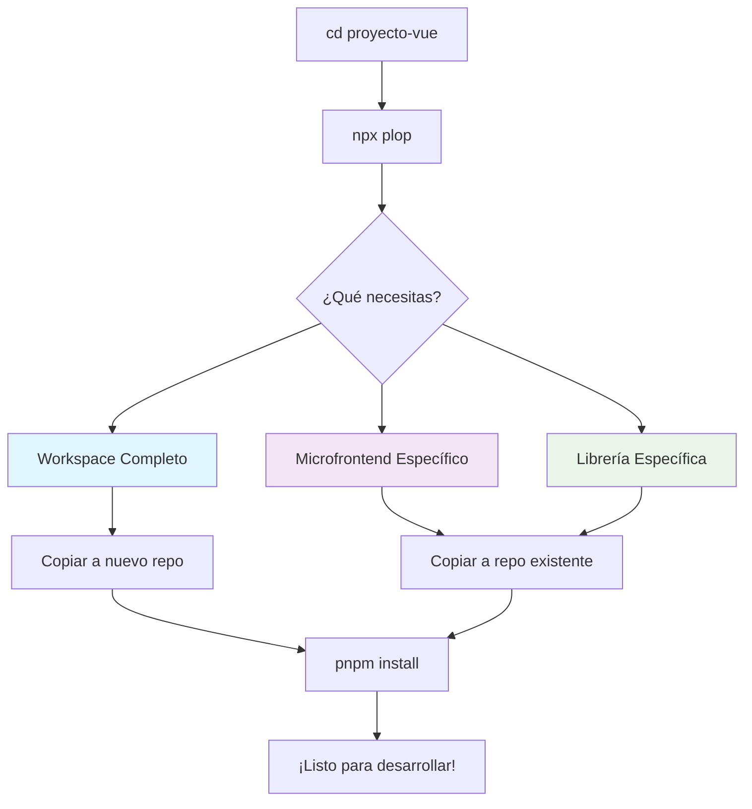

# 🏗️ Sistema de Generación de Proyectos Vue.js con Plop.js

> **Objetivo**: Generar código base consistente y optimizado usando templates actualizados con las mejores prácticas de Vue 3, TypeScript, Vite y Turborepo.

**🎯 Todo en un solo lugar**: Los templates están integrados directamente en `proyecto-vue`. No necesitas clonar repositorios adicionales.

## 📊 Stack Tecnológico

Los proyectos generados incluyen:

| Tecnología | Versión | Uso |
|------------|---------|-----|
| **Vue** | `^3.5.22` | Framework reactivo |
| **TypeScript** | `~5.9.3` | Type safety |
| **Vite** | `^7.1.10` | Build tool & dev server |
| **Turborepo** | `^2.5.8` | Build system para monorepos |
| **pnpm** | `10.18.3` | Package manager |
| **Vitest** | `^3.2.4` | Testing framework |
| **i18next** | `^25.6.0` | Internacionalización |
| **ESLint** | `^9.38.0` | Linting |
| **Prettier** | `^3.6.2` | Code formatting |

---

## ⚡ Workflow Integrado

### 🏗️ Sistema de Templates



**🎯 Beneficios del sistema integrado:**

- ✅ **Un solo repositorio** - Todo desde proyecto-vue
- ✅ **Templates actualizados** - Siempre las últimas mejores prácticas
- ✅ **Consistencia garantizada** - Mismo stack en todos los proyectos
- ✅ **Cero configuración** - Templates pre-probados y funcionales

---

## 🚀 Proceso Completo

### **Setup Inicial** (una sola vez por máquina)

1. **Clonar proyecto-vue**:

   ```powershell
   git clone https://github.com/Lotharok/proyecto-vue
   cd proyecto-vue
   ```

2. **Instalar dependencias**:

   ```powershell
   pnpm install
   pnpm -r build
   ```

3. **Verificar que funciona**:
   ```powershell
   npx plop --version  # Debe mostrar versión de Plop
   ```

> **📝 Nota:** Una vez configurado, solo necesitas `git pull` ocasionalmente para obtener templates actualizados.

---

## 📋 Sistema de Templates Disponibles

### **🏗️ Workspace Completo** - `proyecto-completo`

**¿Cuándo usar?**
- Empiezas un proyecto **completamente nuevo**
- Tu equipo necesita **workspace independiente**
- Quieres **estructura completa** desde cero

**¿Qué genera?**
- **Estructura completa** (@apps/, packages/, configs)
- **Packages base** (types, utils, vue-utils opcionales)
- **Configuraciones** (ESLint, Prettier, TypeScript)
- **Documentación** (README personalizado)

### **🔗 Microfrontends Específicos**

#### **microfrontend-integrado**

**¿Cuándo usar?**
- Se ejecuta dentro de aplicación ASP.NET
- Recibe `window.__params` del host
- Ejemplos: checkout, listados, reservas

**Genera**: @apps/mi-micro/ completo

#### **microfrontend-independiente**

**¿Cuándo usar?**
- SPA completa independiente
- No depende de host ASP.NET
- Ejemplos: admin panels, herramientas internas

**Genera**: @apps/mi-spa/ completo

### **📦 Librerías Específicas**

#### **libreria-vue**

**¿Cuándo usar?**
- Componentes reutilizables
- Composables compartidos
- Depende de Vue/Pinia

**Genera**: packages/vue-mi-lib/ completo

#### **libreria-utils**

**¿Cuándo usar?**
- Funciones puras JavaScript/TypeScript
- Sin dependencias de Vue
- Tipos compartidos

**Genera**: packages/mi-utils/ completo

---

## ⚙️ Configuraciones Técnicas

### 🎯 TypeScript - Configuraciones por Tipo de Paquete

Los templates incluyen configuraciones TypeScript optimizadas para cada caso de uso:

#### **Librerías (`lib.tsconfig.jsonc` y `lib-vue.tsconfig.jsonc`)**

```json
{
  "compilerOptions": {
    "incremental": true,                    // Builds incrementales rápidos
    "composite": true,                      // Project references en monorepos
    "moduleResolution": "bundler",          // Compatible con Vite
    "noEmit": true,                         // Vite compila, no tsc
    "declaration": true,                    // vite-plugin-dts genera .d.ts
    "noUncheckedIndexedAccess": true,       // Mayor seguridad de tipos
    "verbatimModuleSyntax": true            // ESM estricto
  }
}
```

**Características clave:**
- ✅ **Compilación dual**: TypeScript para type-checking, Vite para código JavaScript
- ✅ **Generación de tipos**: `vite-plugin-dts` genera archivos `.d.ts` automáticamente
- ✅ **Builds incrementales**: Cache en `.tmp/` para velocidad
- ✅ **Strict mode completo**: `noUncheckedIndexedAccess`, `exactOptionalPropertyTypes`, etc.

#### **Aplicaciones Vue (`app-vue.tsconfig.jsonc`)**

```json
{
  "extends": "@vue/tsconfig/tsconfig.dom.json",
  "compilerOptions": {
    "noEmit": true,                         // El bundler compila
    "moduleResolution": "bundler",
    "erasableSyntaxOnly": true,             // Optimización de builds
    "noUncheckedSideEffectImports": true    // Previene imports con side effects
  }
}
```

**📁 Ubicación de configs base**: `configs/`
- `lib.tsconfig.jsonc` - Librerías TypeScript puras
- `lib-vue.tsconfig.jsonc` - Librerías Vue
- `app-vue.tsconfig.jsonc` - Aplicaciones Vue

> 📖 **Para documentación técnica detallada de estas configuraciones**, ver [configs/README.md](configs/README.md)

### 🚀 Turborepo - Sistema de Build Optimizado

Los workspaces completos incluyen `turbo.json` con configuración de cacheo inteligente:

```json
{
  "tasks": {
    "build": {
      "dependsOn": ["^build"],              // Builds en orden de dependencias
      "outputs": ["dist/**"],               // Cache de outputs
      "env": ["VITE_*", "NODE_ENV"]         // Variables de entorno
    },
    "lint": {
      "dependsOn": ["^lint"]                // Lint todos los paquetes
    }
  }
}
```

**Beneficios:**
- ⚡ **Cache inteligente**: Solo rebuilds cuando cambian archivos relevantes
- 🔄 **Ejecución paralela**: Builds simultáneos de paquetes independientes
- 📊 **Visualización**: `turbo build --ui=tui` muestra progreso en tiempo real
- 🎯 **Selective builds**: `turbo build --filter=mi-paquete` solo lo necesario

### 📦 pnpm Catalog - Versionado Centralizado

El `pnpm-workspace.yaml` usa catalog para versiones compartidas:

```yaml
catalog:
  vue: ^3.5.22
  typescript: ~5.9.3
  vite-plugin-dts: ^4.5.4
  i18next: ^25.6.0
```

**Ventajas:**
- ✅ **Versiones consistentes**: Un solo lugar para actualizar
- ✅ **Menos conflictos**: Todas las apps usan las mismas versiones
- ✅ **Workspace references**: `workspace:*` para paquetes internos

### 🔧 Vite - Configuración de Librerías

Las librerías usan `vite-plugin-dts` para generación de tipos:

```typescript
export default defineConfig({
  build: {
    lib: {
      entry: path.resolve(__dirname, "src/index.ts"),
      formats: ["es"]
    },
    rollupOptions: {
      output: {
        preserveModules: true,              // Mantiene estructura de módulos
        preserveModulesRoot: "src"
      }
    }
  },
  plugins: [
    dts({
      rollupTypes: false,                   // Tipos separados (mejor tree-shaking)
      insertTypesEntry: true,
      copyDtsFiles: true
    })
  ]
});
```

**Por qué `rollupTypes: false`:**
- ✅ **Mejor tree-shaking**: Bundlers pueden eliminar código no usado
- ✅ **Source maps precisos**: Debugging más fácil
- ✅ **Exports granulares**: Permite importar subpaths específicos

---

## 🎯 Ejemplos de Uso por Escenario

### **Escenario 1: Nuevo Equipo/Proyecto** 🆕

1. **Generar workspace completo**:

   ```powershell
   cd proyecto-vue
   npx plop
   # Seleccionar: proyecto-completo
   # Nombre: "mi-empresa-frontend"
   # Incluir types: Sí
   # Incluir utils: Sí
   ```

2. **Copiar a tu repositorio**:

   ```powershell
   Copy-Item -Recurse ./mi-empresa-frontend/* /ruta/a/mi/nuevo/repo/
   cd /ruta/a/mi/nuevo/repo
   ```

3. **Setup inicial**:

   ```powershell
   pnpm install
   pnpm build
   ```

4. **Crear tu primer microfrontend**:
   ```powershell
   npx plop  # Ahora usa templates copiados
   # Seleccionar: microfrontend-integrado
   ```

### **Escenario 2: Agregar a Proyecto Existente** ➕

1. **Generar componente específico**:

   ```powershell
   cd proyecto-vue
   npx plop
   # Seleccionar: microfrontend-integrado
   # Nombre: "flight-booking"
   ```

2. **Copiar a tu proyecto real**:

   ```powershell
   Copy-Item -Recurse @apps/flight-booking ../mi-proyecto-real/@apps/
   ```

3. **Configurar en tu proyecto**:

   ```powershell
   cd ../mi-proyecto-real
   # Agregar al package.json: "app-flight-booking": "pnpm --filter flight-booking"
   pnpm install
   ```

4. **Desarrollar**:
   ```powershell
   pnpm app-flight-booking dev
   ```

### **Escenario 3: Crear Librería Compartida** 📚

1. **Generar librería**:

   ```powershell
   cd proyecto-vue
   npx plop
   # Seleccionar: libreria-vue
   # Nombre: "vue-date-picker"
   ```

2. **Copiar a tu proyecto real**:

   ```powershell
   Copy-Item -Recurse packages/vue-date-picker ../mi-proyecto-real/packages/
   ```

3. **Configurar y usar**:
   ```powershell
   cd ../mi-proyecto-real
   # Agregar al package.json: "lib-vue-date-picker": "pnpm --filter vue-date-picker"
   pnpm install
   pnpm lib-vue-date-picker build
   ```

---

## 🔍 Validaciones Automáticas

El generador incluye validaciones para mantener consistencia:

| Validación             | Descripción                                      | Error ejemplo                                       |
| ---------------------- | ------------------------------------------------ | --------------------------------------------------- |
| **Nombres únicos**     | Verifica que no existe en `@apps/` o `packages/` | `Ya existe un microfrontend con el nombre "review"` |
| **Formato kebab-case** | Solo minúsculas y guiones                        | `Use formato kebab-case (ejemplo: mi-proyecto)`     |
| **Prefijo vue-**       | Librerías Vue deben comenzar con `vue-`          | `Las librerías Vue deben comenzar con "vue-"`       |
| **Descripción mínima** | Al menos 10 caracteres                           | `La descripción debe tener al menos 10 caracteres`  |

---

## 🆕 Mantener Templates Actualizados

### **Obtener últimas mejoras**:

```powershell
cd proyecto-vue
git pull origin main
pnpm install  # Si hay nuevas dependencias
```

### **¿Qué se actualiza automáticamente?**

El equipo de arquitectura mantiene actualizados:

- ✅ **Nuevos tipos de templates** según necesidades del equipo
- ✅ **Mejores configuraciones** (ESLint, TypeScript, Vite)
- ✅ **Dependencias actualizadas** en el catalog
- ✅ **Nuevos patterns** y mejores prácticas

> **💡 Tip:** Con un simple `git pull` tienes acceso a todas las mejoras del equipo sin configuración adicional.

---

## ✅ Checklist de Uso

### Pre-generación

- [ ] `proyecto-vue` clonado y actualizado (`git pull`)
- [ ] Decidido qué tipo de proyecto necesitas
- [ ] Nombre en kebab-case definido
- [ ] Ruta de destino clara para copiar el código

### Post-generación

#### **Para Workspace Completo:**

- [ ] Código copiado al nuevo repositorio
- [ ] `pnpm install` ejecutado en el nuevo repo
- [ ] `pnpm build` completado exitosamente
- [ ] Para más componentes: volver a proyecto-vue y usar (`npx plop`)

#### **Para Código Específico:**

- [ ] Componente copiado al proyecto real
- [ ] Script añadido al `package.json` del proyecto real
- [ ] `pnpm install` ejecutado
- [ ] Código funciona (`pnpm app-{nombre} dev` o `pnpm lib-{nombre} build`)

### Validación final

- [ ] Hot reload funcionando (microfrontends)
- [ ] No errores TypeScript
- [ ] Build exitoso
- [ ] Linting sin warnings

---

## 🎯 Ventajas del Sistema Integrado

### **Para Desarrolladores**

- **⚡ Un solo comando** para generar código funcional
- **🎯 Cero configuración** - Todo pre-configurado y probado
- **🔧 Always updated** - Templates mejoran automáticamente
- **📚 Documentación viva** - Templates como ejemplos funcionales

### **Para el Equipo**

- **🏗️ Estándares enforced** - Arquitectura consistente automática
- **📈 Onboarding acelerado** - Nuevos miembros productivos desde día 1
- **🔄 Mejora continua** - Templates evolucionan con la experiencia
- **🛡️ Calidad garantizada** - Configuraciones probadas en producción

> **💡 Filosofía:** Los templates no son solo boilerplate, son la cristalización de las mejores prácticas del equipo, siempre actualizadas.

---

## 🛠️ Comandos Útiles

### Desarrollo en Monorepo

```bash
# Build completo con cache de Turborepo
pnpm build

# Build con UI interactiva
pnpm build --ui=tui

# Build de un paquete específico
turbo build --filter=mi-paquete

# Build sin cache (force rebuild)
turbo build --force

# Lint de todo el monorepo
pnpm lint

# Format de todo el código
pnpm format

# Dev de un microfrontend específico
pnpm app-mi-micro dev

# Build de una librería específica
pnpm lib-mi-lib build
```

### Gestión de Dependencias

```bash
# Agregar dependencia a un workspace específico
pnpm --filter mi-paquete add vue-router

# Agregar dependencia usando catalog
pnpm --filter mi-paquete add i18next@catalog:

# Actualizar todas las dependencias del catalog
# Editar pnpm-workspace.yaml y luego:
pnpm install

# Ver qué paquetes usan una dependencia
pnpm why vue

# Limpiar node_modules y reinstalar
pnpm clean-install  # o rm -rf node_modules && pnpm install
```

> **📚 Guía completa de dependencias:** Ver [configs/README.md - Dependencies Management](configs/README.md#-dependencies-management) para aprender cómo manejar correctamente `dependencies`, `devDependencies` y `peerDependencies` en librerías y apps.

### Turborepo

```bash
# Ver qué tareas están disponibles
turbo run build --dry-run

# Limpiar cache de Turbo
turbo clean

# Ver estadísticas de cache
turbo build --summarize

# Ejecutar tarea en todos los paquetes
turbo run test
```

---

## 🐛 Troubleshooting

### Problema: "Could not resolve entry module"

**Síntoma:** Error al hacer build de una librería
```
Could not resolve entry module "src/mi-archivo.ts"
```

**Solución:**
1. Verificar que el archivo existe en la ruta especificada
2. Revisar `vite.config.ts` - el `entry` debe apuntar a archivos que existen
3. Si no necesitas el entry, quítalo de la configuración

**Ejemplo correcto:**
```typescript
// vite.config.ts
lib: {
  entry: {
    index: path.resolve(__dirname, "src/index.ts"),  // ✅ Existe
    // NO incluir archivos que no existen
  }
}
```

### Problema: TypeScript no encuentra tipos

**Síntoma:** `Cannot find module '@pnpmworkspace/types'`

**Solución:**
1. Build el paquete de tipos primero:
   ```bash
   pnpm lib-types build
   ```
2. Verificar que existe `dist/index.d.ts` en el paquete
3. Verificar `package.json` exports:
   ```json
   {
     "exports": {
       ".": {
         "types": "./dist/index.d.ts"
       }
     }
   }
   ```

### Problema: Builds lentos

**Síntoma:** `pnpm build` tarda mucho tiempo

**Solución:**
1. Usar Turborepo que ya incluye cache:
   ```bash
   turbo build  # En lugar de pnpm -r build
   ```
2. Habilitar builds incrementales (ya configurado en templates):
   ```json
   // tsconfig.json
   {
     "compilerOptions": {
       "incremental": true,
       "tsBuildInfoFile": "./node_modules/.tmp/tsconfig.tsbuildinfo"
     }
   }
   ```
3. Verificar que `.turbo` no está en `.gitignore`

### Problema: Colisión de tsBuildInfoFile

**Síntoma:** Tipos incorrectos o builds que no detectan cambios

**Solución:**
Cada paquete debe tener un nombre único para `tsBuildInfoFile`:

```json
// ❌ MAL - Nombre genérico
{
  "tsBuildInfoFile": "./node_modules/.tmp/tsconfig.tsbuildinfo"
}

// ✅ BIEN - Nombre único
{
  "tsBuildInfoFile": "./node_modules/.tmp/tsconfig.mi-paquete.tsbuildinfo"
}
```

Los templates ya incluyen nombres únicos usando `{{kebabCase name}}`.

> 📖 **Más detalles:** Ver [configs/README.md](configs/README.md#-errores-comunes) para explicación completa de este y otros errores de TypeScript.

### Problema: Hot reload no funciona

**Síntoma:** Cambios en el código no se reflejan en el navegador

**Solución:**
1. Verificar que Vite está corriendo:
   ```bash
   pnpm app-mi-micro dev
   ```
2. Verificar puerto (default: 5173)
3. Limpiar cache del navegador (Ctrl+Shift+R)
4. Si usas WSL, verificar configuración de red:
   ```typescript
   // vite.config.ts
   export default defineConfig({
     server: {
       host: '0.0.0.0',  // Permite acceso desde fuera de WSL
       watch: {
         usePolling: true  // Necesario en algunos sistemas
       }
     }
   });
   ```

---

## 📚 Recursos Adicionales

### Documentación Oficial

- [Vue 3 Docs](https://vuejs.org/)
- [TypeScript Handbook](https://www.typescriptlang.org/docs/)
- [Vite Guide](https://vitejs.dev/guide/)
- [Turborepo Handbook](https://turbo.build/repo/docs)
- [pnpm Workspace](https://pnpm.io/workspaces)

### Configuraciones de Referencia

- **[configs/README.md](configs/README.md)** - Guía completa de configuraciones TypeScript (extensión de configs, opciones explicadas, errores comunes)
- **[template-structure.json](template-structure.json)** - Estructura de todos los templates
- **[plopfile.js](plopfile.js)** - Lógica de generación de código

---
